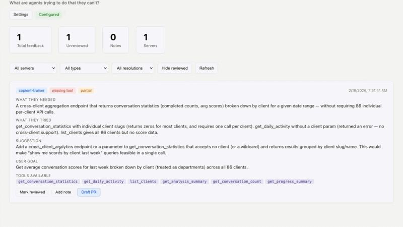
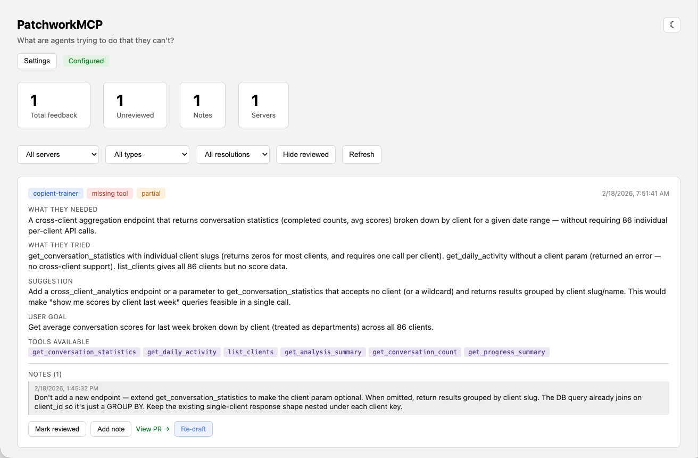
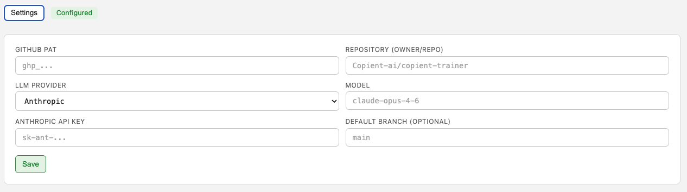

# PatchworkMCP

**Your MCP servers have blind spots. Your agents already know what they are.**

PatchworkMCP adds a feedback tool to any MCP server. When an agent hits a gap — missing tool, wrong format, incomplete data — it tells you exactly what it needed and how to fix it. Then it drafts the PR.

No guessing. No feature request backlogs. Just structured signal from the agents that actually use your tools.



---

## What Happens When You Wire This Up

We added PatchworkMCP to an AI cost tracking MCP server. Within one session, Claude reported:

> **Gap:** `missing_tool` \
> **What it needed:** A tool to search cost events by context field values (e.g., run_id, session_id) \
> **What it tried:** `get_costs`, `get_usage_events` — neither supported context-based filtering \
> **Suggestion:** "A `search_costs_by_context` tool that accepts context key-value pairs with AND logic, combined with standard date/service/customer filters. Returns paginated event records with full context."

That's not a vague complaint. That's a tool spec. PatchworkMCP can take that feedback, read your repo, and open a draft PR with the implementation.

## Where It Fits Today

PatchworkMCP is built for **early-stage MCP server development** — when you're actively building tools and need fast signal about what's missing. Wire it up, let agents use your server, and see exactly where they hit walls. The draft PR feature means you can go from gap report to working code in under a minute.

This is the MVP. The bigger picture is below in [Where This Is Going](#where-this-is-going).

## How It Works

```
Agent hits a wall          Feedback captured           You review + ship

  ┌──────────────┐    POST    ┌──────────────┐        ┌──────────────┐
  │  MCP Server  │ ────────▶  │  Sidecar     │ ─────▶ │  Dashboard   │
  │  + feedback  │            │  SQLite      │        │  Draft PR    │
  │    tool      │            │  FastAPI     │        │  one click   │
  └──────────────┘            └──────────────┘        └──────────────┘
```

1. Copy a **single file** into your MCP server (Python, TypeScript, Go, or Rust)
2. Agents call the feedback tool when they can't do what the user asked
3. Browse `localhost:8099` to review feedback, add notes, spot patterns
4. Click **Draft PR** — PatchworkMCP reads your repo, sends the feedback + code context to an LLM, and opens a draft pull request with the suggested fix



## Quick Start

**30 seconds to running:**

```bash
git clone https://github.com/keyton-weissinger/patchworkmcp.git
cd patchworkmcp
uv run server.py
```

Open http://localhost:8099. That's the sidecar — it stores feedback and serves the dashboard.

**Now wire up your MCP server.** Pick your language, copy one file:

<details>
<summary><strong>Python (FastMCP) — 2 lines</strong></summary>

Copy `drop-ins/python/feedback_tool.py` into your project.

```bash
uv add httpx  # or: pip install httpx
```

```python
from mcp.server.fastmcp import FastMCP
from feedback_tool import register_feedback_tool

server = FastMCP("my-server")
register_feedback_tool(server, "my-server")
```

</details>

<details>
<summary><strong>Python (Django MCP)</strong></summary>

Copy `drop-ins/python/feedback_tool.py` into your tools directory.

```bash
uv add httpx
```

```python
from mcp.tools.registry import mcp_tool
from feedback_tool import TOOL_NAME, TOOL_DESCRIPTION, TOOL_INPUT_SCHEMA, send_feedback_sync

@mcp_tool(name=TOOL_NAME, description=TOOL_DESCRIPTION, input_schema=TOOL_INPUT_SCHEMA)
def feedback(credential, arguments):
    return send_feedback_sync(arguments, server_name="my-server")
```

</details>

<details>
<summary><strong>Python (Raw MCP SDK)</strong></summary>

Copy `drop-ins/python/feedback_tool.py` into your project.

```python
from feedback_tool import get_tool_definition, send_feedback

# In your list_tools handler:
tools.append(get_tool_definition())

# In your call_tool handler:
if name == "feedback":
    result = await send_feedback(arguments, server_name="my-server")
```

</details>

<details>
<summary><strong>TypeScript</strong></summary>

Copy `drop-ins/typescript/feedback-tool.ts` into your project. No extra dependencies — uses built-in `fetch` (Node 18+).

```typescript
import { McpServer } from "@modelcontextprotocol/sdk/server/mcp.js";
import { registerFeedbackTool } from "./feedback-tool.js";

const server = new McpServer({ name: "my-server", version: "1.0.0" });
registerFeedbackTool(server, "my-server");
```

</details>

<details>
<summary><strong>Go</strong></summary>

Copy `drop-ins/go/feedback_tool.go` into your project. Only depends on `github.com/mark3labs/mcp-go` and stdlib.

```go
import "your-project/feedback"

s := server.NewMCPServer("my-server", "1.0.0")
feedback.RegisterFeedbackTool(s, "my-server")
```

</details>

<details>
<summary><strong>Rust</strong></summary>

Copy `drop-ins/rust/feedback_tool.rs` into your project.

```toml
[dependencies]
reqwest = { version = "0.12", features = ["json"] }
serde = { version = "1", features = ["derive"] }
serde_json = "1"
```

```rust
use feedback_tool::{payload_from_args, send_feedback, TOOL_NAME, TOOL_DESCRIPTION};

let payload = payload_from_args(&args, "my-server");
let message = send_feedback(&payload).await;
```

</details>

**Test it:** Use your MCP server via Claude Desktop, Cursor, Claude Code, etc. Ask the agent to do something the server can't handle. Check http://localhost:8099 — you'll see what it reported.

## Draft PRs from Feedback

This is the payoff. Click **Draft PR** on any feedback card and PatchworkMCP will:

1. Read your repo's file tree via GitHub API
2. Score files by MCP relevance and select the most important ones
3. Send the feedback + **your notes** + code context to the LLM with structured output enforcement
4. Create a branch, commit the change, and open a draft PR

You get a real-time progress modal showing each step. The PR links back to the original feedback.

### Setup

Configure your GitHub PAT, repo, and LLM provider in the dashboard settings panel:



| Provider | Default Model |
|---|---|
| Anthropic | `claude-opus-4-6` |
| OpenAI | `GPT-5.2-Codex` |

Both use structured output with constrained decoding — the LLM returns valid JSON every time.

### Notes guide the LLM

Before clicking Draft PR, add notes to the feedback card. Notes are human-written annotations — "the real issue is missing pagination", "look at how `get_costs` handles this", "this should be a new tool, not a param on the existing one." These get sent to the LLM as prioritized developer context, so the generated PR reflects what you actually want, not just what the agent reported.

Notes are append-only with timestamps, so you build up context over multiple review sessions. The progress modal shows when notes are being included.

### Re-drafting

First PR not quite right? Click **Re-draft** to generate a new one. Refine your notes between attempts — the LLM sees the updated context each time. The old PR stays on GitHub; the dashboard link updates to point to the new one.

## What Gets Captured

Every feedback item includes:

| Field | Required | Purpose |
|---|---|---|
| `what_i_needed` | Yes | The missing capability — the core signal |
| `what_i_tried` | Yes | What the agent attempted first. Separates "didn't find it" from "doesn't exist" |
| `gap_type` | Yes | `missing_tool` · `incomplete_results` · `missing_parameter` · `wrong_format` · `other` |
| `suggestion` | No | The agent's proposed fix. Often includes a full tool signature. |
| `user_goal` | No | What the human was trying to do. Prioritize by real user impact. |
| `resolution` | No | `blocked` · `worked_around` · `partial` |
| `tools_available` | No | What tools the agent could see. Context for the gap. |
| `agent_model` | No | Which model reported it. Separate model confusion from real gaps. |
| `session_id` | No | Groups feedback from one conversation. Reveals multi-step failures. |

**Notes** are append-only with timestamps — you never lose an annotation.

## Configuration

| Variable | Default | Description |
|---|---|---|
| `FEEDBACK_SIDECAR_URL` | `http://localhost:8099` | Where drop-ins send feedback |
| `FEEDBACK_API_KEY` | *(none)* | Optional shared secret for auth |
| `FEEDBACK_DB_PATH` | `./feedback.db` | SQLite path for the sidecar |
| `FEEDBACK_PORT` | `8099` | Port for `uv run server.py` |

Draft PR settings (GitHub PAT, API keys) are stored in a `.env` file that's gitignored — not in the database.

## API

| Method | Endpoint | Description |
|---|---|---|
| `POST` | `/api/feedback` | Submit feedback (called by drop-ins) |
| `GET` | `/api/feedback` | List feedback with filters |
| `GET` | `/api/feedback/{id}` | Single item with notes |
| `PATCH` | `/api/feedback/{id}` | Toggle reviewed status |
| `POST` | `/api/feedback/{id}/notes` | Add a note |
| `POST` | `/api/feedback/{id}/draft-pr` | Generate a draft PR (SSE stream) |
| `GET` | `/api/stats` | Counts by server, gap type, resolution |
| `GET` | `/api/settings` | Current settings (keys masked) |
| `PUT` | `/api/settings` | Update settings |

## Architecture

The entire sidecar is **one Python file** (`server.py`). No framework, no build step, no Docker required. FastAPI + SQLite + inline HTML/CSS/JS.

```
patchworkmcp/
  server.py          # Everything: API, database, UI, GitHub client, LLM integration
  feedback.db        # Created on first run
  .env               # API keys (gitignored)
  drop-ins/
    python/          # FastMCP, Django MCP, raw SDK
    typescript/      # @modelcontextprotocol/sdk
    go/              # mcp-go
    rust/            # reqwest-based
  docs/              # Screenshots and demo media
```

## Adding a Drop-in for a New Language

The sidecar API is the stable contract. Any language can participate by:

1. Defining the tool schema (name, description, input properties)
2. POSTing JSON to `{SIDECAR_URL}/api/feedback`
3. Providing a framework-specific registration helper

If you build one, open a PR. The pattern: one file, zero extra deps beyond the MCP SDK.

## Where This Is Going

What you see today is a developer tool: feedback comes in, you review it, you click a button, you get a PR. That's useful, but it's step one.

The end state is a **self-monitoring system for MCP servers.** Feedback accumulates across sessions, users, and agents. PatchworkMCP learns to deduplicate reports, cluster related gaps, and grade them by frequency and severity. Instead of acting on the first report of a missing tool, it waits — sees that 15 different sessions hit the same wall, that 8 of them were fully blocked, and that the agents all suggested roughly the same fix. Then it acts.

The human stays in the loop, but how much control you want is a spectrum:

| Level | What happens | Who decides |
|---|---|---|
| **Suggestions only** | PatchworkMCP surfaces prioritized gaps with analysis | You build it yourself |
| **Draft PRs** | Generates a PR for review (where we are today) | You review and merge |
| **Auto-PRs** | Opens PRs automatically when confidence is high | You merge |
| **Auto-merge** | Ships vetted changes to your server | Guardrails + your approval rules |

Every level up requires more guardrails — confidence thresholds, test coverage requirements, scope limits, rollback hooks. We're building those incrementally, not shipping "auto-merge" as a flag you can flip tomorrow.

### Shipped

- [x] Feedback capture and review dashboard
- [x] Drop-ins for Python, TypeScript, Go, Rust
- [x] Append-only notes with timestamps
- [x] LLM-powered draft PRs from feedback (Anthropic + OpenAI)
- [x] Structured output enforcement (constrained decoding)
- [x] Real-time progress streaming during PR creation
- [x] Developer notes as LLM context for better PRs
- [x] Re-draft workflow for iterating on PRs
- [x] Dark / light theme

### Next

- [ ] Feedback deduplication and clustering (group similar reports across sessions)
- [ ] Severity scoring based on frequency, resolution type, and user impact
- [ ] Multi-file PRs
- [ ] Webhook notifications for new feedback
- [ ] Confidence-gated auto-PRs with configurable thresholds
- [ ] Export to CSV/JSON

## License

MIT
